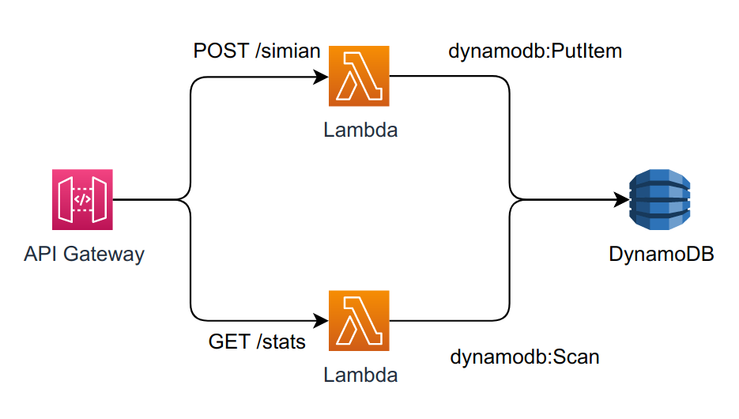

# Desafio Meli Símios
## Algoritmo
O algortimo da aplicação é baseado na ideia de um caça-palavras. Antes de processar a matriz enviada, sua validade é verificada em alguns quesitos, como se a mesma é uma **matriz quadrada**, ou seja, **NxN**, se a matriz contém apenas caracteres **'A'**, **'T'**, **'C'** ou **'G'**, ressaltando que a validação é **case sensitive**, e por fim é validado também se a matriz **não está vazia**. Caso a matriz seja inválida, é retornado **400**. Sendo uma matriz válida, o algoritmo tentará achar a **sequência de 4 caracteres iguais** nas linhas **horizontais**, **verticais** e **diagonais** da matriz. Caso pelo menos uma sequência seja encontrada, o DNA identificado é de um **símio**, retornando então **200**, caso contrário, ou seja, não seja encontrada nenhuma sequência de 4 carateres iguais, o DNA identificado é de um **humano**, retornando então **403**. Após o DNA válido ser verificado, o mesmo é armazenado no banco de dados com seu respectivo tipo, humano ou símio.
## Arquitetura
A arquitetura construída para a aplicação foi baseada em um modelo **Serverless**, fazendo uso de recursos da **AWS**. Foi criada uma **API REST** via **API Gateway**, uma **Lambda** para cada endpoint da API e o **DynamoDB** para armazenar e consultar os DNAs verificados. O modelo construído é baseado no seguinte diagrama:
